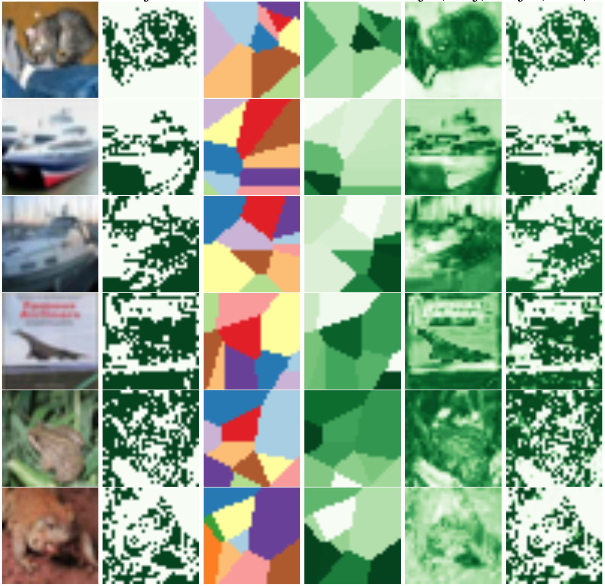

# A Weakly Supervised Approach for Estimating Spatial Density Functions from High-Resolution Satellite Imagery

## Synthetic Data Example using CIFAR

Usage: `python run_cifar.py` (use `-h` to see more options)

Code for running synthetic data example, training different methods using the `RegionAccumulator` layer.

Used to create both data and sample images in the paper.

